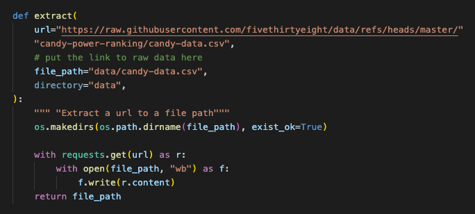
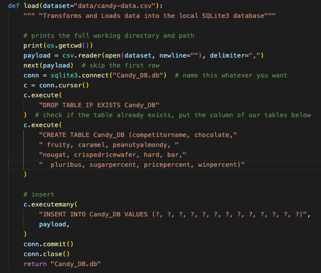
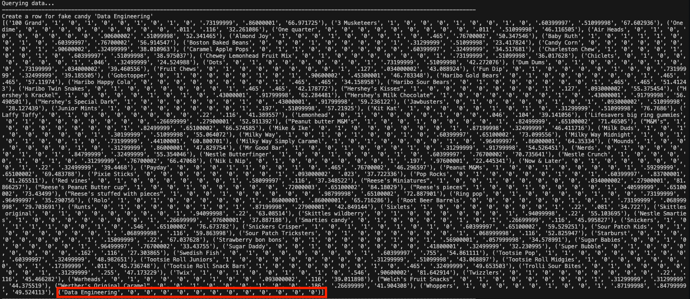
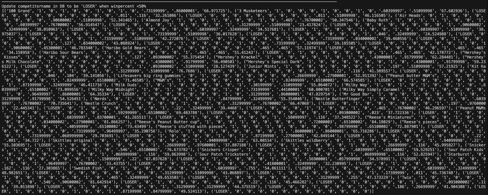
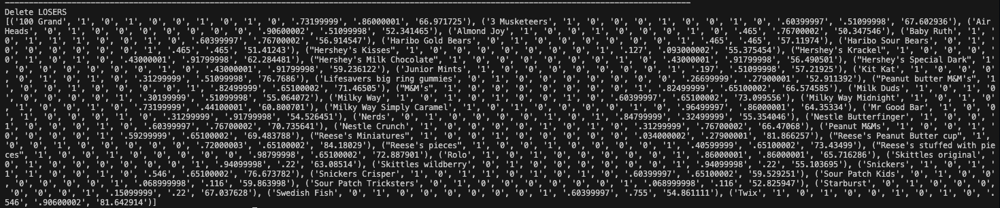

# Kayla_Haeussler_MiniProject_5

[](https://github.com/nogibjj/Kayla_Haeussler_Mini_Project_5/actions/workflows/cicd.yml)

IDS 706: Mini Project 5  
Python Script Interacting with SQL Database  
Kayla Haeussler  

The purpose of this assignment is to create a workflow that integrates an external data source with a SQLite database while executing SQL queries using a Python script. This will involve implementing the four fundamental operations that can be performed on a database or data repository: Create, Read, Update, and Delete (CRUD operations).

```
Kayla_Haeussler_Mini_Project_5/
├── .devcontainer/
│   ├── devcontainer.json
│   └── Dockerfile
├── .github/
│   └── workflows/cicd.yml
├── data/
│   └── candy_data.csv
├── mylib/
│   ├── __init__.py
│   ├── __pycache__/
│   ├── extract.py
│   ├── query.py
│   └── transform_load.py
├── .gitignore
├── Candy_DB.db
├── Dockerfile
├── LICENSE
├── main.py
├── Makefile
├── README.md
├── requirements.txt
├── setup.sh
└── test_main.py
```
## Assignment Requirements
* Connect to a SQL database
* Perform CRUD operations
* Write at least two different SQL queries

## Data Set
The data set used in this project comes from the '''fivethirtyeight''' repository, called candy-data.csv, that contains candy power ranking data. 
https://github.com/fivethirtyeight/data/tree/master/candy-power-ranking
## ETLQ: Extract, Transform, Load, Query

The above image references GroceryDB, in our case this is the Candy_DB database. This image was forked from the repo this repo was initially forked from and is not my own creation.
### Extract:
Extract a dataset from a URL.


### Transform & Load:
Transform the data by clening, filtering, enriching, etc to get it ready for analysis. Load the transformed data into a SQLite database table using Python's sqlite module.


### Query (CRUD)
Write and execute SQL queries on the SQLite database to analyze and retrieve insights from the data.
#### Create, Read, Update, Delete
The following shows the output when the ```main.py``` script is run, showing through output that the database queries are successful. ```read()``` is utilized to print the database to the terminal





## References
https://github.com/nogibjj/sqlite-lab


